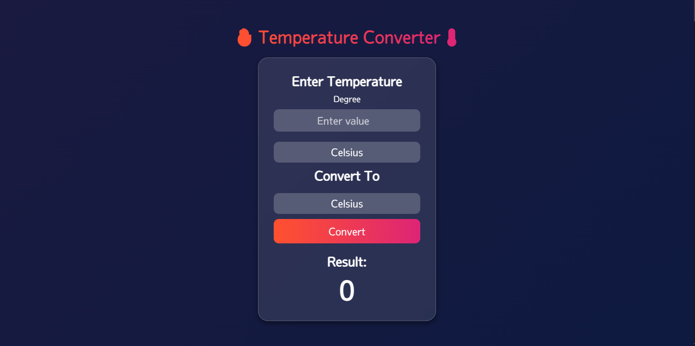

# Temperature-Conversion

## Introduction
Hello, this is one of my newbie projects that I made—a simple temperature conversion program using JavaScript. This project is a great way to understand the basics of converting temperature units.

## Project Overview
The Temperature Converter is a basic web application that allows users to convert temperatures between Celsius, Fahrenheit, and Kelvin. It demonstrates user input handling, mathematical conversions, and dynamic UI updates.

## Features

- **User-Friendly Interface**: Simple and intuitive design for ease of use.
- **Real-Time Conversion**: Instantly converts temperature values as you input them.
- **Responsive Design**: The layout adapts to different screen sizes, providing a seamless experience on both desktop and mobile devices.
- **Multiple Unit Support**: Converts between Celsius, Fahrenheit, and Kelvin.

## Technologies Used

- **HTML**: Structures the web page and input elements.
- **CSS**: Styles the interface, ensuring a clean and responsive design.
- **JavaScript**: Handles the conversion logic and updates the temperature values in real-time.

##Screenshot

